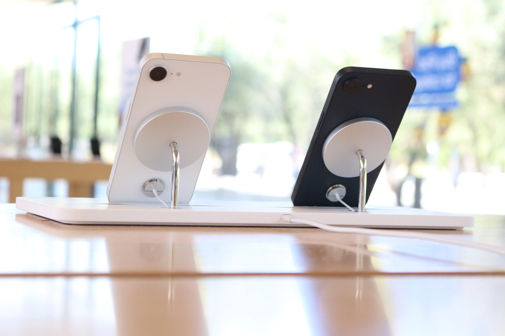
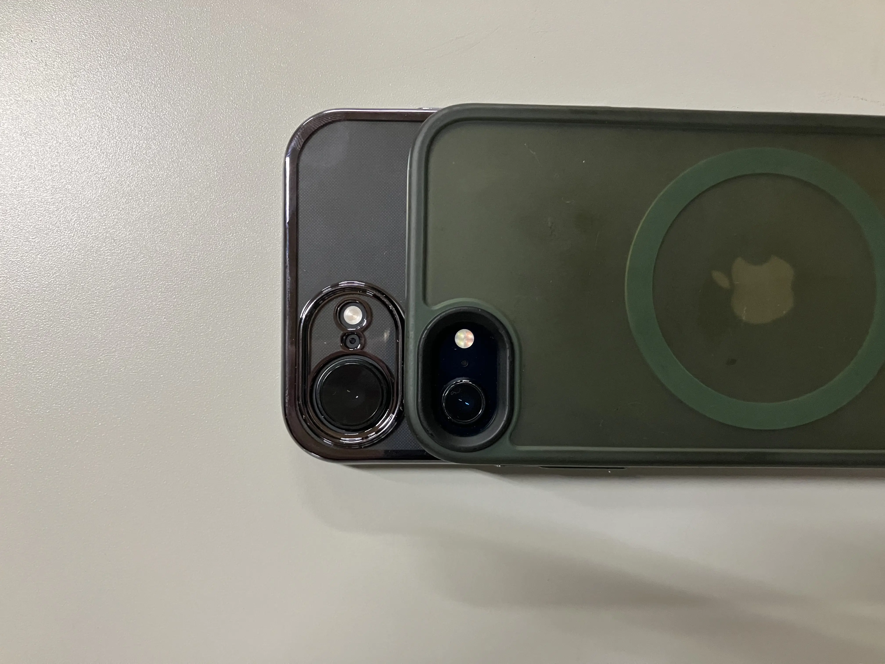

## はじめに

iPhone 16eから始まったiPhoneのeシリーズ。  
通常のモデルが例年9月に発表されるのに対し、eシリーズは約5ヶ月後。  
性能に対して価格が釣り合ってないとの声が大きかった16eだが、17eが発表されるまでの1年間で**「ちょっと手頃で見た目可愛いiPhone」**としての地位を築いていたのではないか。（僕の独断と偏見です）  
今回はそんなiPhone eシリーズの意義を考えていく。 　　　　

<figure class="article-image">

<figcaption>Apple Park Visitor Centerにて2025/8/13、撮影。</figcaption>
</figure>

## SEとeは、何か違うのか

eシリーズを語るには、その前身であるSEシリーズとの比較が欠かせない。  
SEシリーズは「小型・安価」を軸に設計されていた。初代（2016年）はiPhone 5sの筐体に当時最新のA9を搭載し、第2世代（2020年）はiPhone 8のボディにA13 Bionic、第3世代（2022年）も同じiPhone 8ベースの筐体のままA15 Bionicを積んだ。  
つまりSEのコンセプトは一貫して「古い外身に新しいチップ」だった。  
その結果、SE第3世代はホームボタンを残し、4.7インチのディスプレイサイズを維持し、MagSafeも持たなかった。最新チップが載っていても、見た目と触感が数世代古く、「廉価版」という印象は拭えなかった。

対してeシリーズは、この設計思想を根本から変えた。  
iPhone 16eはiPhone 13/14と同じ6.1インチ筐体を採用し、ホームボタンを廃してFace IDへ移行、アクションボタンを搭載した。  
iPhone 17eではSEシリーズはもちろん16eでも見送られていたMagSafeにも対応。  
「古い筐体の再利用」ではなく、現行世代として設計された端末だ。  
カメラコントロールやDynamic Islandのような「付加価値」とも言える機能は削ぎ落としつつ、衛星通信やCeramic Shield、1日余裕で持つバッテリーなどの生活に欠かせない機能はしっかりと搭載されている。  
SEが古い筐体に足し算の考え方で作られたiPhoneだとすると、eシリーズは現行モデルに引き算の考え方で作られたとも言えるだろう。

<figure class="article-image">

<figcaption aria-hidden="true">SEと16eのカメラサイズ比較。同じシングルカメラでもちゃんと進化している。</figcaption>
</figure>

## 無印・Proと、eの立ち位置

では同世代の無印やProと比べると、eはどこに位置するのか。  
iPhone 17は\$799、iPhone 17 Proは\$1,099から。対してiPhone 17eは\$599だ。無印との価格差は\$200。その差で何が省かれているかを見ると、eのキャラクターが浮かぶ。  
Dynamic Islandは非搭載でFace IDはノッチ式、カメラはシングルの48MP Fusionのみ、カメラコントロールもなく、ディスプレイはProMotionなしの60Hz——機能面での割り切りは明確だ。  
しかし逆に言えば、A19チップ、MagSafe、アクションボタン、Apple Intelligence対応、256GBスタートという主要どころはしっかり押さえている。  
無印との差は「あったら嬉しい機能」の有無であって、「日常使いに困る」差ではない。  
ここがeシリーズの絶妙なラインだ。  
最近のProシリーズは映画制作にも使えるほどプロフェッショナルな用途に特化していっている。  
その中、無印は数世代前のProと同等の性能を持つようになった。

## 「割高」批判と、それでも売れた理由

iPhone 16eが発表されたとき、「性能に対して価格が見合わない」という批判が多かった。  
\$599という価格は前世代のSE第3世代（\$429）より\$170高く、それだけの価値を見出せた人が少なかったのだろう。  
確かに、同価格帯のAndroid勢と比べてスペックシートで見劣りするのは否めなかった。  
それでも16eが一定の支持を集めたのは、スペック以外の部分にある。  
10万円を切るという心理的なハードルの低さ、Appleのエコシステム、デザインの質感——これらはスペック表に現れない価値だ。  
加えて、16eには「ちょうどいいサイズ感と見た目」という訴求力があった。  
ブラックとホワイトの2色展開と、iPhone 13/14譲りのスッキリした筐体は「このiPhoneかわいい」という入口からの購入も少なくなかったはずだ。

## Apple Intelligenceと、eシリーズの戦略的役割

eシリーズの意義を語るうえで、Apple Intelligenceの存在は外せない。  
iPhoneでApple Intelligenceを使うには、8GB以上のRAMが必要だ。  
これはiPhone 15 ProおよびProMax以降の機種に限られ、無印のiPhone 15でさえ対象外だった。  
iPhone 16eに搭載されたA18、iPhone 17eに搭載されたA19はいずれもこの条件を満たし、Apple Intelligenceにフル対応する。  
つまりeシリーズは、登場初代から「最新のAIが使えるiPhone」として設計されていた。  
Appleとしては、フラッグシップを買えないユーザーにも最新のAI機能を届けることで、ユーザーベース全体のApple Intelligence対応率を底上げしたい狙いがある。  
\$599でAppleの最新チップとAI機能を提供する——これはAndroidのミッドレンジへの強力な回答でもある。

…とはいえApple Intelligenceの開発の遅れには失望を隠せない。今後のAppleに期待しよう。

## eシリーズが示すAppleの意図

SEからeへの転換が意味するのは、「廉価版」というカテゴリの廃止とも言えるだろう。  
SEはラインナップの外縁に置かれた特別な存在だった。  
対してeシリーズは、Appleが「iPhone 17ファミリーのなかでもっとも手頃なメンバー」と表現するように、iPhone 16ファミリー、iPhone 17ファミリーの一員として明示的に位置づけられている。  
「e」が何の略かAppleは説明していない。  
「essential」「entry」「everyone」——どれも説得力はある。  
ただ、「Special Edition」を意味したSEと対比すると、ひとつの読み方が浮かぶ。  
SEは「特別な一台」というニュアンスを持っていた。対してeは特別さを主張しない。  
iPhoneをより多くの人に届けるための「普遍性」を体現する記号として機能しているように見える。

## 終わりに

「ちょっと手頃で見た目可愛いiPhone」——この表現は、Appleが意図していたポジショニングと、実際にユーザーに受け取られた印象が一致した、珍しいケースかもしれない。  
eシリーズはまだ2世代目だ。Dynamic Islandの非搭載など、無印との差は依然としてある。  
しかしSEが「廉価版」という印象を最後まで払拭できなかったのに対し、eシリーズは最初から「ちゃんとしたiPhoneの、手頃な選択肢」として設計されていると感じられる。  
17e発表時には16eほど批判の声が目立たなかったのは、eシリーズの魅力・役割が浸透した結果かもしれない。  
eシリーズがiPhoneのエントリーラインとして定着するかどうか。  
それはAppleがこのラインをどれだけ本気で育てていくかにかかっている。
